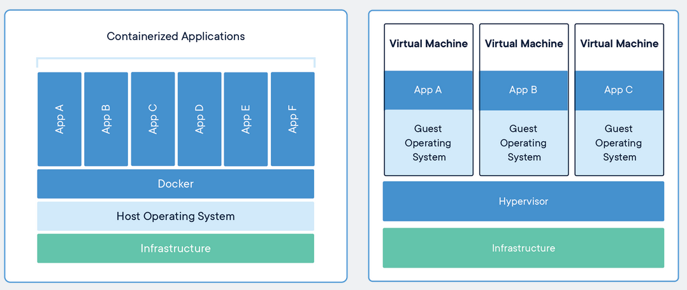

# microservices_docker_kubernetes
Web Application Deployment using Microservices, Docker and Kubernetes

# Docker

#### DockerContainer: 
A container is a standard unit of software that packages up code and all its dependencies so the application runs quickly and reliably from one computing environment to another. 

#### DockerImage: 
A Docker container image is a lightweight, standalone, executable package of software that includes everything needed to run an application: code, runtime, system tools, system libraries and settings.

#### DockerEngine:
Container images become containers at runtime and in the case of Docker containers - images become containers when they run on #DockerEngine.

#### Why Docker:
Containers isolate software from its environment and ensure that it works uniformly despite differences for instance between development and staging.  

