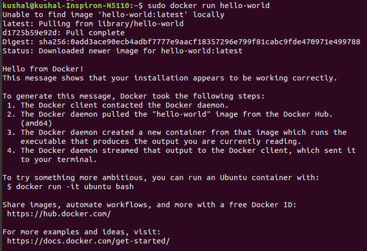

# Overview of Docker editions 
(https://docs.docker.com/install/overview/)

- Docker is available in two editions:

> *Community Edition (CE):* (CE) is ideal for individual developers and small teams looking to get started with Docker and experimenting with container-based apps.

> *Enterprise Edition (EE):* (EE) is designed for enterprise development and IT teams who build, ship, and run business critical applications in production at scale.


# Install Docker on Ubuntu System
(https://docs.docker.com/install/linux/docker-ce/ubuntu/#upgrade-docker-ce)

- It's time to install docker on Ubuntu

#### Uninstall old versions

```
$ sudo apt-get remove docker docker-engine docker.io
```

#### SET UP THE REPOSITORY

1. Update the apt package index:

```
$ sudo apt-get update

```

2. Install packages to allow apt to use a repository over HTTPS:

```
$ sudo apt-get install \
    apt-transport-https \
    ca-certificates \
    curl \
    software-properties-common
```

3. Add Docker’s official GPG key:

```
$ curl -fsSL https://download.docker.com/linux/ubuntu/gpg | sudo apt-key add -
```

- Verify the fingerprint

```
$ sudo apt-key fingerprint 0EBFCD88
```

4. Use the following command to set up the stable repository. 

```

$ sudo add-apt-repository \
   "deb [arch=amd64] https://download.docker.com/linux/ubuntu \
   $(lsb_release -cs) \
   stable"
```


#### INSTALL DOCKER CE
1. Update the apt package index.

```
$ sudo apt-get update
```

2. Install the latest version of Docker CE

```
$ sudo apt-get install docker-ce
```	

3. Verify that Docker CE is installed correctly by running the hello-world image.

```
$ sudo docker run hello-world
```

# DOCKER IS SUCCESSFULLY INSTALLED

